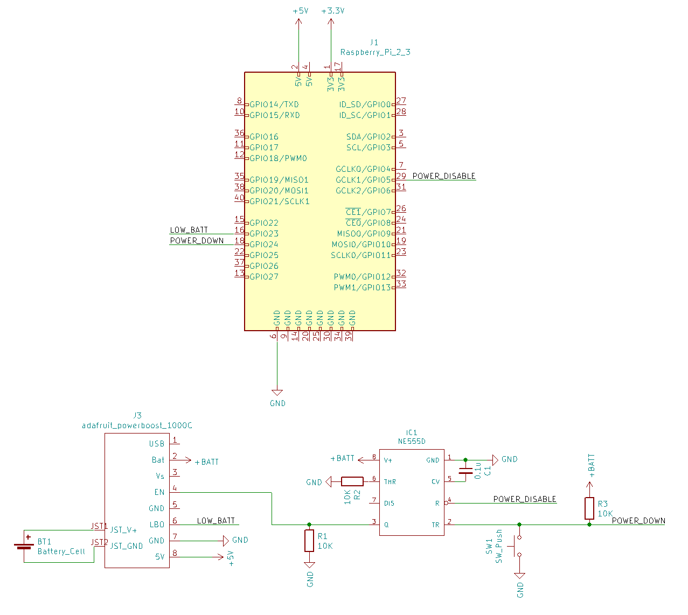

LiPoPi 555
=======

## Purpose
LiPoPi 555 can be used to achieve all of the following on a Raspberry Pi:
* Power with a LiPo battery
* Charge LiPo battery
* Startup RPi wih momentary button press
* Safe shutdown with press of same momentary button
* Safe shutdown on low battery

NB This version performs the same functions as the [power-up/power-down](/README.power_up_power_down.md) version of LiPoPi , however uses an alternate circuit with a 555 timer IC.  

## Equipment:
* Raspberry Pi
* Adafruit PowerBoost 500/Adafruit PowerBoost 1000C
* 1 x LM555
* 3 x 10k resistors
* 1 x 100nF capacitor
* 1 x LiPo battery

## Schematic


## Explanation
The 555 timer here is being used for its internal SR latch.  The button press to power up the Rpi sets the latch, producing a high output that enables the PowerBoost output.  

Once the Rpi starts to boot, the `power_disable` pin goes high.

Once the lipopi service starts, the switch is monitored for power down requests.  If this is detected, the rpi initiates a shutdown.  Once the rpi is shutdown, the `power_disable` pin is pulled low.  This causes the latch in the 555 to reset, sending the output low, disabling the PowerBoost output. 

The default pins used in lipopi 555:
* POWER_DISABLE: GPIO5 (output)
* LOW_BATTERY: GPIO23 (input)
* POWER_DOWN: GPIO24 (input)

## Setup:

1. Clone the repository
    ```bash
    $ cd ~
    $ git clone https://github.com/jsinkers/lipopi.git
    ```
    
2. Update config.py if you want to use different pins.  You can also select different log file names/locations, and time to wait before shutdown.  To edit:
    ```bash
    $ cd ~\lipopi
    $ sudo nano config.py
    ```
    The `power_disable_pin` needs to start at HIGH once pi is booted, and go LOW once the rpi shuts down.  This pin is not controlled by the lipopi service.  There are a limited number of pins that boot to HIGH.  

    Per "BCM2835 Arm Peripherals 6.2 Alternative function assignments" valid pins are:
    * GPIO/BCM: 0, 1, 2, 3, 4, 5, 6, 7, 8, 34, 35, 36
    
3.  In order to switch the `power_disable_pin` low after shutdown to power off, we will use the power-off dtoverlay.
    ```bash
    $ sudo nano /boot/config.txt`
    ```    
    Add the following line:
    
    `dtoverlay=gpio-poweroff,gpiopin=5,active_low="y"`
    Replace "5" with whichever `power_disable_pin` you are using.

4. Shut down:
    ```bash
    $ sudo shutdown now
    ```
    Power off the device. 
5. Use your switch to power up.  Once you are powered up, run the lipopi script to check it is working. 
    ```bash
    $ sudo python3 ~/lipopi/lipopi.py
    ```
    Press your switch to see if a shutdown is initiated.  If possible conduct a similar test connecting the `low_battery_pin` to ground to simulate low battery, and check it also iniiates a shutdown.

6. Copy the service file to /etc/systemd
    ```bash
    $ sudo cp lipopi.service /etc/systemd/system/.
    ```
7. Enable and start the service

    ```bash
    $ sudo systemctl enable lipopi.service
    $ sudo systemctl start  lipopi.service
    ```   
8. All done! Test everything is working. 

